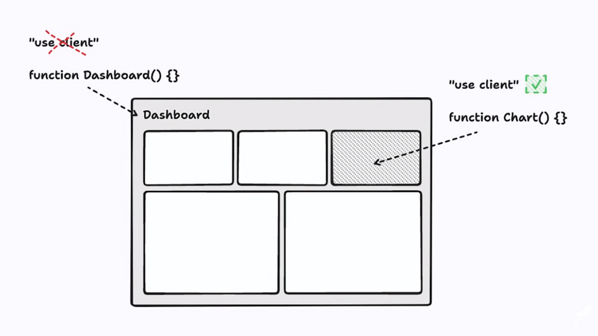
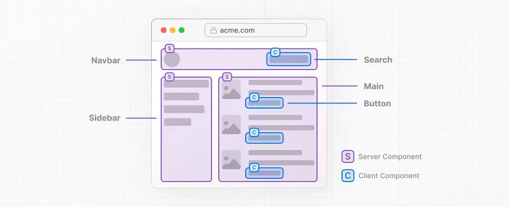

## O Que São Server Components?

A proposta dos Server Components é reduzir a quantidade de JavaScript enviado para o navegador ao construir aplicações React.
Algumas das principais vantagens da arquitetura de Server Components são mover componentes, que não têm interação direta com o usuário, ou que não têm estado interno, da renderização do lado cliente para a renderização do lado servidor. Esse tipo de abordagem visa resolver alguns problemas comuns de aplicações front-end, como alto número de requests feitos para um servidor externo, podendo causar lentidão no sistema, aumentar a latência e, consequentemente, o tempo de resposta.

## Client Components

Os Client Components são utilizados para incluir interações na parte do cliente da uma aplicação, como ações do usuário e alterações de estado. Esses componentes podem ser pré-renderizados no servidor e depois “hidratados” no cliente através da diretiva “use client”.
O processo de Hidratação occorre quando o React realiza uma "injeção" os valores como JSON e as instruções JavaScript no HTML renderizado, tornando assim a página interativa.
O princpial objetivo da utilização seria encapsular apenas a parte do componente que necessita de interatividade, evitando excesso de JavaScript no navegador.

  

## Server Components

Os Server Components foram introduzidos na versão 18 do React e adaptados para o Next.js 13. Eles permitem que os componentes sejam renderizados no lado do servidor, reduzindo assim a quantidade de JavaScript enviada para o cliente. O principal objetivo é deixar a renderização de todo processo que não envolve interação com o usuário a cargo do servidor, como data fetching, conexão com banco de dados, páginas estáticas e dependências que antes impactavam o pacote JavaScript baixado pelo cliente.

    

## Reefrencias

- [Next.js Documentation](https://nextjs.org/docs)
- [Portal TabNews](https://www.tabnews.com.br/gloredo/parte-1-next-js-13-estrategias-de-renderizacao-com-pages-router-vs-app-router)
- [Blog Rocketseat](https://blog.rocketseat.com.br/server-components-no-react/)
- [Compreendendo Client e Server Components no React 18 e Next.js 13](https://medium.com/@julianofirme23/compreendendo-client-e-server-components-no-react-18-e-next-js-13-cb2af8832d00)
- [Server Components do jeito certot](https://www.youtube.com/watch?v=L1osqF17iDM&ab_channel=Rocketseat)
- [React Server Components: A Comprehensive Breakdown](https://www.youtube.com/watch?v=VIwWgV3Lc6s&t=121s&ab_channel=Theo-t3%E2%80%A4gg)

